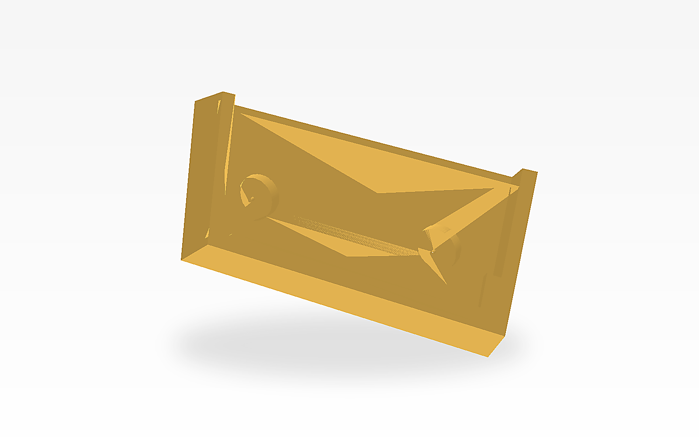
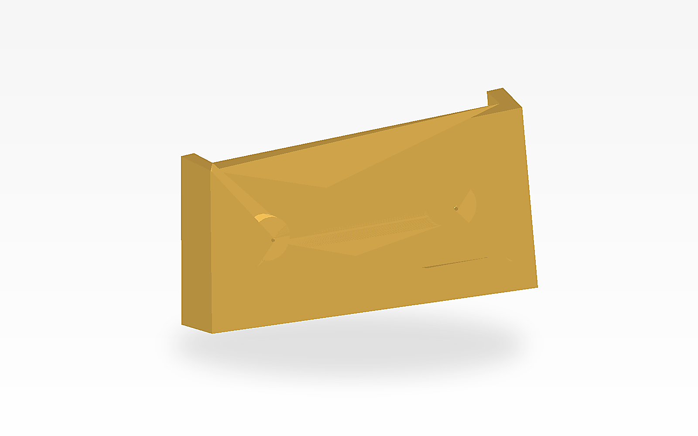

# M5PaperColor Wall Mount

日本語: M5Stack社のM5PaperColorを横置きで、画鋲2本で壁に掛けるための3Dプリント用マウントです。M5Paper S3用マウントと同じ基本構造を、M5PaperColorの外形寸法に合わせて作り直しています。

English: A 3D-printable landscape wall mount for the M5Stack M5PaperColor that hangs on two thumbtacks. This adapts the same basic structure as the M5Paper S3 wall mount to the M5PaperColor dimensions.




## 概要 / Overview

- M5PaperColorを横置きで壁にすっきり掛けて使うためのシンプルなホルダーです。
- 2本の画鋲を壁に固定し、その軸にマウント背面の穴を通して取り付けます。
- M5PaperColor本体は前面の開口部から差し込み、下側のリップと左右ストッパーで位置決めします。

- A simple landscape holder for mounting the M5PaperColor on a wall.
- The mount attaches to two thumbtacks driven into the wall, using the rear pin holes.
- The device slides in from the front opening and is positioned by the lower lip and stopper tabs.

## 特長 / Features

- OpenSCADソース付きで、寸法の調整や派生モデル作成がしやすい
- すぐに印刷できる `M5PaperColorWallMount.stl` を同梱
- 画鋲の頭を逃がす円形リセス付き
- 画鋲の軸を通す貫通穴付き

- Includes the original OpenSCAD source for easy customization
- Ships with a ready-to-print `M5PaperColorWallMount.stl`
- Circular rear recesses provide clearance for thumbtack heads
- Through-holes align the mount to the thumbtack pins

## ファイル構成 / Files

- `M5PaperColorWallMount.scad`: オリジナルのOpenSCADソース / Original OpenSCAD source
- `M5PaperColorWallMount.stl`: 3Dプリント用のSTL / STL for 3D printing
- `tools/render_stl_preview.py`: STLからREADME用PNGを生成するスクリプト / Script for rendering README PNGs from the STL
- `assets/preview-front.png`: README掲載用の前方イメージ / Front preview image for the README
- `assets/preview-rear.png`: README掲載用の背面イメージ / Rear preview image for the README

## 寸法 / Dimensions

- 対象機器サイズ: 70.8 mm x 103.9 mm x 8.5 mm
- 外形サイズ: 約 114.5 mm x 18.5 mm x 58.1 mm
- 開口部サイズ: 約 104.5 mm x 53.1 mm
- 画鋲頭用リセス: 直径 15 mm、深さ 5 mm
- 画鋲ピン用穴: 直径 1.4 mm
- 画鋲ピン穴間隔: 66.0 mm

- Target device size: 70.8 mm x 103.9 mm x 8.5 mm
- Outer size: about 114.5 mm x 18.5 mm x 58.1 mm
- Front opening: about 104.5 mm x 53.1 mm
- Thumbtack head recesses: 15 mm diameter, 5 mm deep
- Thumbtack pin holes: 1.4 mm diameter
- Thumbtack pin spacing: 66.0 mm

## 使用した画鋲 / Tested Thumbtacks

- 使用した画鋲: [Amazon.co.jp B0012R8HYG](https://www.amazon.co.jp/dp/B0012R8HYG)
- 上記の画鋲に合わせて、画鋲頭用リセスとピン穴を設計しています。

- Tested thumbtacks: [Amazon.co.jp B0012R8HYG](https://www.amazon.co.jp/dp/B0012R8HYG)
- The rear head recesses and pin holes are designed around these thumbtacks.

## 印刷のヒント / Printing Notes

- 背面の平らな面をビルドプレート側にして印刷すると安定します。
- 一般的なFDMプリンタでは、通常はサポートなしでも印刷しやすい形状です。
- 機器差やプリンタ差で嵌合が変わるため、必要に応じてOpenSCAD側で `fit_clearance_w` や `fit_clearance_d` を微調整してください。

- Print with the flat rear face on the build plate for stability.
- On a typical FDM printer, the model should usually print without supports.
- Fit can vary by printer and material, so adjust `fit_clearance_w` or `fit_clearance_d` in OpenSCAD if needed.

## 使い方 / Usage

1. `M5PaperColorWallMount.stl` を3Dプリントします。
2. 壁に画鋲を2本取り付けます。
3. マウント背面の穴を画鋲に合わせて壁へ固定します。
4. M5PaperColorを前面から差し込みます。

1. Print `M5PaperColorWallMount.stl`.
2. Install two thumbtacks in the wall.
3. Hang the mount on the thumbtacks using the rear holes.
4. Slide the M5PaperColor in from the front.

## OpenSCAD からの再生成 / Regenerating the STL

OpenSCAD がインストールされていれば、以下のコマンドで STL を再生成できます。

If OpenSCAD is installed, regenerate the STL with:

```sh
openscad M5PaperColorWallMount.scad -o M5PaperColorWallMount.stl
```

README掲載画像は、STLから以下のように再生成できます。

README preview images can be regenerated from the STL with:

```sh
python3 tools/render_stl_preview.py M5PaperColorWallMount.stl assets/preview-front.png front
python3 tools/render_stl_preview.py M5PaperColorWallMount.stl assets/preview-rear.png rear
```

## 注意 / Notes

- 本データは M5PaperColor 向けに作成した個人制作のマウントです。
- 使用する画鋲や壁材によって保持力は変わるため、安全性は現物で確認してください。
- `M5PaperColor` および `M5Stack` はそれぞれの権利者に帰属する名称です。

- This is an independent wall-mount design for the M5PaperColor.
- Holding strength depends on the thumbtacks and wall material, so verify safety with your own setup.
- `M5PaperColor` and `M5Stack` are names owned by their respective rights holders.
